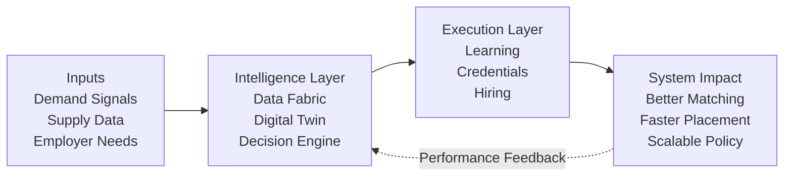

```mermaid
flowchart LR
    A[Inputs<br/>Demand Signals<br/>Supply Data<br/>Employer Needs]
    B[Intelligence Layer<br/>Data Fabric<br/>Digital Twin<br/>Decision Engine]
    C[Execution Layer<br/>Learning<br/>Credentials<br/>Hiring]
    D[System Impact<br/>Better Matching<br/>Faster Placement<br/>Scalable Policy]

    A --> B --> C --> D
    D -. Performance Feedback .-> B
```
