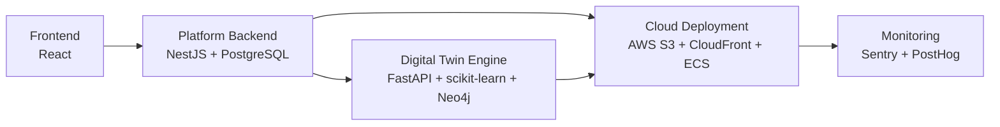

```mermaid
flowchart LR
    A[Frontend<br/>React]
    B[Platform Backend<br/>NestJS + PostgreSQL]
    C[Digital Twin Engine<br/>FastAPI + scikit-learn + Neo4j]
    D[Cloud Deployment<br/>AWS S3 + CloudFront + ECS]
    E[Monitoring<br/>Sentry + PostHog]

    A --> B
    B --> C
    B --> D
    C --> D
    D --> E
```
