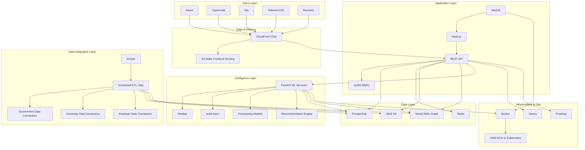

```mermaid
flowchart TB
    subgraph Client["Client Layer"]
        A1[React]
        A2[TypeScript]
        A3[Vite]
        A4[Tailwind CSS]
        A5[Recharts]
    end

    subgraph Edge["Edge & Delivery"]
        B1[CloudFront CDN]
        B2[S3 Static Frontend Hosting]
    end

    subgraph App["Application Layer"]
        C1[NestJS]
        C2[Node.js]
        C3[REST API]
        C4[Auth0 RBAC]
    end

    subgraph Intelligence["Intelligence Layer"]
        D1[FastAPI ML Services]
        D2[Pandas]
        D3[scikit-learn]
        D4[Forecasting Models]
        D5[Recommendation Engine]
    end

    subgraph Data["Data Layer"]
        E1[PostgreSQL]
        E2[Redis]
        E3[AWS S3]
        E4[Neo4j Skills Graph]
    end

    subgraph Pipelines["Data Integration Layer"]
        F1[Airbyte]
        F2[Scheduled ETL Jobs]
        F3[Government Data Connectors]
        F4[University Data Connectors]
        F5[Employer Data Connectors]
    end

    subgraph Infra["Infrastructure & Ops"]
        G1[Docker]
        G2[AWS ECS or Kubernetes]
        G3[Sentry]
        G4[PostHog]
    end

    A1 --> B1
    A2 --> B1
    A3 --> B1
    A4 --> B1
    A5 --> B1

    B1 --> B2
    B1 --> C3

    C1 --> C2
    C2 --> C3
    C3 --> C4
    C3 --> E1
    C3 --> E2
    C3 --> E3
    C3 --> E4

    D1 --> D2
    D1 --> D3
    D1 --> D4
    D1 --> D5
    D1 --> E1
    D1 --> E4

    F1 --> F2
    F2 --> F3
    F2 --> F4
    F2 --> F5
    F2 --> E1
    F2 --> E4
    F2 --> E3

    C3 --> D1

    C1 --> G1
    D1 --> G1
    G1 --> G2
    C3 --> G3
    C3 --> G4
```
