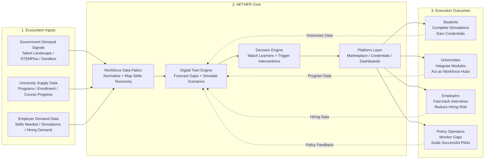

```mermaid
flowchart LR
    subgraph A["1. Ecosystem Inputs"]
        A1[Government Demand Signals<br/>Talent Landscape / STEMPlus / Sandbox]
        A2[University Supply Data<br/>Programs / Enrollment / Course Progress]
        A3[Employer Demand Data<br/>Skills Needed / Simulations / Hiring Demand]
    end

    subgraph B["2. AETHER Core"]
        B1[Workforce Data Fabric<br/>Normalize + Map Skills Taxonomy]
        B2[Digital Twin Engine<br/>Forecast Gaps + Simulate Scenarios]
        B3[Decision Engine<br/>Match Learners + Trigger Interventions]
        B4[Platform Layer<br/>Marketplace / Credentials / Dashboards]
    end

    subgraph C["3. Execution Outcomes"]
        C1[Students<br/>Complete Simulations<br/>Earn Credentials]
        C2[Universities<br/>Integrate Modules<br/>Act as Workforce Hubs]
        C3[Employers<br/>Fast-track Interviews<br/>Reduce Hiring Risk]
        C4[Policy Operators<br/>Monitor Gaps<br/>Scale Successful Pilots]
    end

    A1 --> B1
    A2 --> B1
    A3 --> B1

    B1 --> B2 --> B3 --> B4

    B4 --> C1
    B4 --> C2
    B4 --> C3
    B4 --> C4

    C1 -. Outcomes Data .-> B2
    C2 -. Program Data .-> B2
    C3 -. Hiring Data .-> B2
    C4 -. Policy Feedback .-> B2
```
